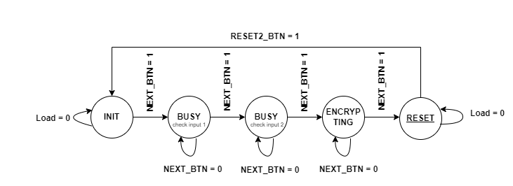

# Digital-Lock-System

## Created By

Albertus Timothy Gunawan &nbsp;(2106651515) 
Eldisja Hadasa &nbsp;&nbsp;&nbsp;&nbsp;&nbsp;&nbsp;&nbsp;&nbsp;&nbsp;&nbsp;&nbsp;&nbsp;&nbsp;&nbsp;&nbsp;&nbsp;&nbsp;&nbsp;&nbsp;&nbsp;&nbsp;&nbsp;(2106640133) 
Fatima Khairunnisa &nbsp;&nbsp;&nbsp;&nbsp;&nbsp;&nbsp;&nbsp;&nbsp;&nbsp;&nbsp;&nbsp;&nbsp;&nbsp;&nbsp;&nbsp;(2106651515) 
Muhammad Fajri Alqomaril &nbsp;&nbsp;(2106651635)  

## Overview
`Digital Lock System adalah sistem keamanan yang memiliki dua metode diimplementasikan dengan FPGA (Field Programming Gate Array). Digital Lock System ini memiliki 6 input password dan fitur enskripsi untuk keamanan passwordnya. `

## How it works
`Digital Lock System memiliki dua metode. Metode pertama adalah pemeriksaan kesesuaian input semua password bedasarkan password yang telah disimpan di memory. Metode kedua adalah kesesuaian dua digit password yang diacak sesuai algoritma yang ditelah dibuat. Dimana jika user memasukkan password yang tepat, LED akan menyala yang menandakan slock sistem terbuka. Setelah sistem lock dibuka rangkaian akan kembali ke keadaan awal sebelum dimasukkan password oleh user.`

## Features
Berikut fitur-fitur yang digunakan

### 7-Segment
`7-Segment digunakan sebagai user interface untuk menampilkan password yang sedang diinput oleh user ke dalam Digital Lock System.`

### Debounce Algorithm
`Pada pengimplementasian Digital Lock System, digunakan button untuk memasukkan tiap angka password dan untuk me-reset rangkaian. Pada dasarnya, saat menekan button sering terjadi ketidakstablian sinyal yang disebabkan oleh button itu sendiri (saklar manual). Oleh karena itu, digunakan debounce algorithm untuk menstabilkan sinyal dari button agar dapat di proses oleh system tanpa kendala sehingga sinyal dapat diproses dengan efektif.`

### Encryption (Hashing)
`Hashing atau enkripsi password digunakan untuk mengamankan password yang dimiliki oleh user. `

### Generate Random Number
`Generate Random Number digunakan untuk memilih digit kesekian yang harus dimasukkan user ke device agar lock system terbuka.`

## Finite State Machine

### Metode 1

`Pada gambar dapat dilihat, state pertama device berada pada INIT - rangkaian sedang diinisialisasi - dan setiap state yang ada akan berubah ketika NEXT_BUTTON bernilai 1. Lalu state akan berubah dari BUSY1 sampai BUSY6 sesuai dengan digit password yang di proses. Pada saat password yang dimasukkan sudah benar semua, rangkaian akan berada pada state RESET dan kembali ke state INIT.`

### Metode 2

`Device berada pada state INIT - inisialisasi -  an setiap state yang ada akan berubah ketika NEXT_BUTTON bernilai 1. Pada saat user selesai memasukkan password, password akan di enkripsi. Setelah itu, device akan di-reset kembali ke state INIT.`

### Debounce Algorithm

`Debounce algorithm memiliki dua state yang akan berubah jika NEXT_BTN berubah nilai. Seperti pada gambar, state dari DEBOUNCE_INIT berubah ketika NEXT_BUTTON bernilai 1 dan tetap pada state yang sama saat NEXT_BUTTON bernilai 0. Sementara itu, state dari SHIFT_STATE berubah ketika NEXT_BUTTON bernilai 0 dan tetap pada state yang sama saat NEXT_BUTTON bernilai 1. `